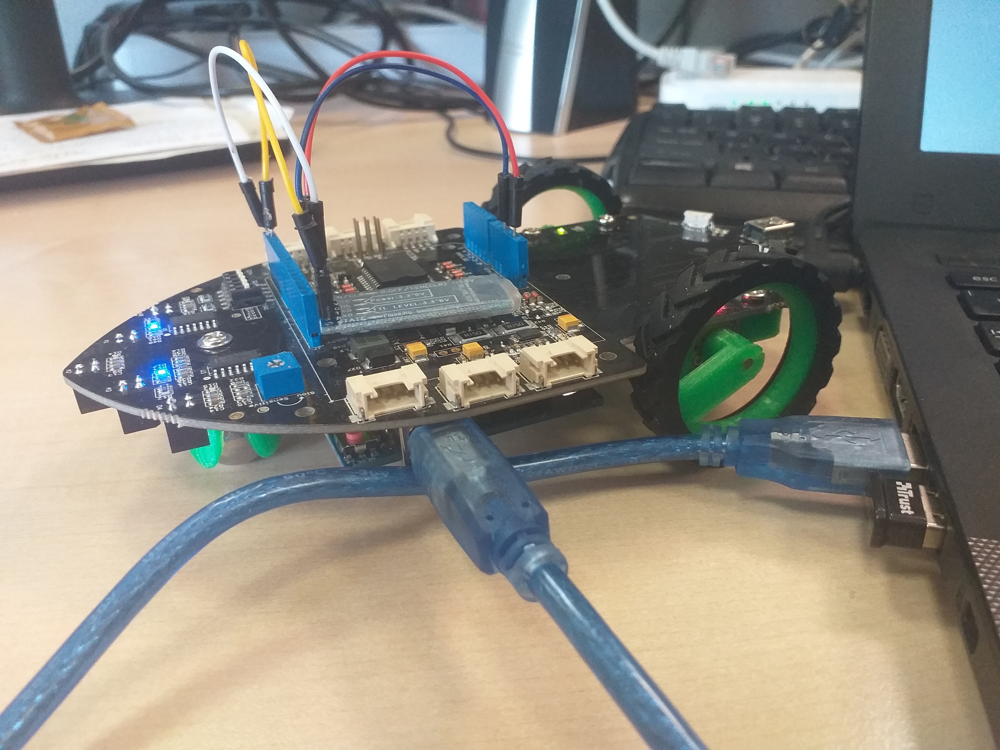

# ARTe demo application
Arduino UNO code for the vocally controlled car.

## Installation
  1. Download the repository
  2. open the .ino file with Arduino IDE
  3. install the ARTe extension (Arduino Real-Time extension) in your Arduino IDE as described at http://arte.retis.santannapisa.it/
  4. install an Arduino UNO board on a Shield Bot v1.2, as available at http://wiki.seeedstudio.com/Shield_Bot_V1.2/
  5. connect a bluetooth module as described at https://github.com/HerrAugust/skill-smart-car
  6. upload the code to the Arduino UNO board
  7. optionally, install Mycroft and the Mycroft skill as below

## Bluetooth control
You can use "Arduino bluetooth controller" by Giumig Apps from the Android Google Play to test the application.
In the "Controller mode", you need to set the following commands to some buttons you choose. Alternatively,
you can simply send one of them as a string.
1. tlf
2. goa
3. trg
4. stp
5. flwln
6. slow
7. fast

## The Mycroft skill
Even if this demo works on its own via bluetooth, to fully appreciate the demo with vocal commands you need to also install the Mycroft skill, available at https://github.com/HerrAugust/skill-smart-car. More information in the repository.

## How the app works
The car receives commands via bluetooth and via the Arduino IDE serial monitor.
It is user choice how to give those commands.
The car has 3 modes: STOPPED, AUTO and MANUAL. It starts in STOPPED mode.
In this state (STOPPED mode), the accepted command are:
1. "follow line" ("fwln" for short), in which case the car enters AUTO mode
2. "go ahead", "go back", "turn left", "turn right", in which case
  the car enters MANUAL mode

In AUTO mode, the car follows a line and the accepted commands are:
1. "go ahead", "go back", "turn left", "turn right", in which case
  the car enters MANUAL mode

In MANUAL mode, the car performs the required command pnly. Accepted commands are:
1. "go ahead"
2. "go back" and "go backwards"
3. "turn left"
4. "turn right"
5. "stop", in which case the car enters STOPPED mode

The car behaviour is drived by some periodic tasks. Sensing and driver tasks have the
highest priorities since have control of the car.
1. Communication task      - receives cmds from bluetooth
2. Control task            - stores info about sensors and,
                            based on the current modes and user commands,
                            controls the motors and their available speeds,
                            making the car move.
                            
Credits: A.Mascitti, M.Marinoni
This code is based on the one by Stefano Maugeri,
https://www.hackster.io/stefano_maugeri/autonomous-line-follower-with-seeed-shield-bot-1-2-and-arte-4faf68
More info available at the paper [paper under revision].

## Tests
Arduino UNO code tested on Funduino UNO with Arduino IDE 1.9.0 beta for Linux 64 bit (Ubuntu 18.04 used).
Vocal commands have been given via Mycroft. The bluetooth module HC-06 has been used.

Memo: The Mycroft skill must stay on its own repository to be cloned on Raspberry or PC!
